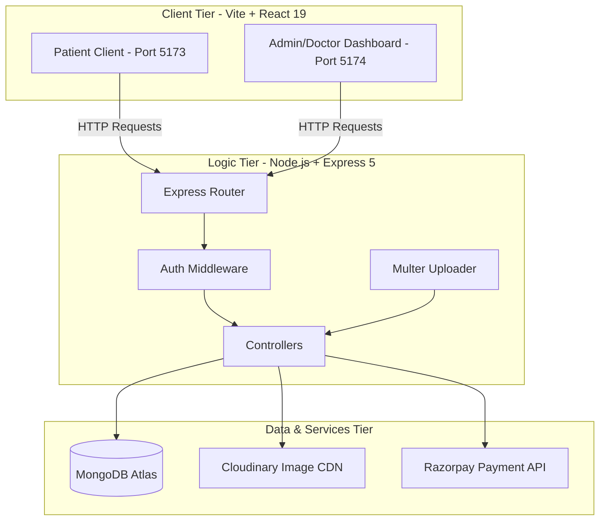
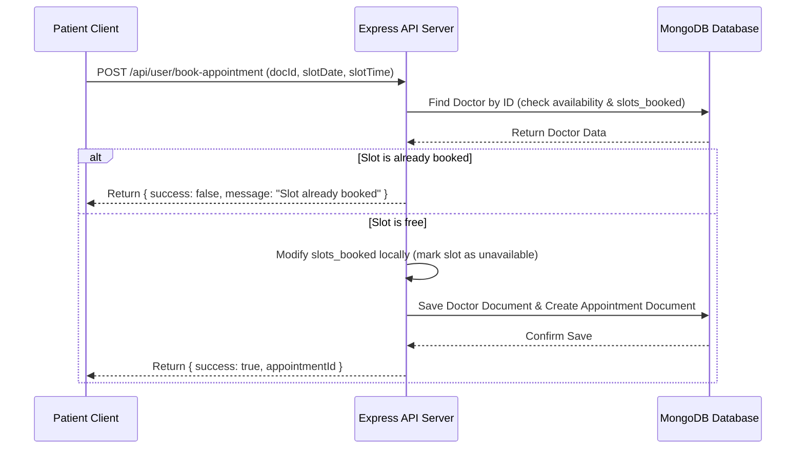

# 🚀 Prescripto: Full-Stack System Design & Interview Guide

This guide compiles the complete system architecture, data models, workflows, and technical challenge resolutions for the **Prescripto Doctor-Patient Booking Platform**. Use this to prepare for your project walkthrough and technical interviews.

---

## 1. High-Level System Architecture

Prescripto uses a modern **3-Tier Monolith Architecture** utilizing the **MERN Stack**. It separates concerns cleanly between the client applications, the backend API server, and the database/third-party integration layer.



---

## 2. Tech Stack & Architectural Justifications

* **Vite + React 19**: Vite provides near-instantaneous Hot Module Replacement (HMR) and fast production builds compared to traditional Create React App (Webpack). React 19 provides robust declarative component management and clean Context API patterns.
* **Tailwind CSS v4 + Vanilla CSS**: Allowed rapid prototyping of layouts combined with fine-grained control over custom Figma components (glassmorphism cards, micro-animations, and dynamic states).
* **Node.js + Express 5**: An asynchronous, single-threaded runtime environment suited for handling high volumes of concurrent I/O operations (like booking requests).
* **MongoDB + Mongoose 9**: A document-oriented NoSQL database. Chosen because schema structures for profiles (especially the nested slots schedule of a doctor) are dynamic and fit JSON documents perfectly.
* **Cloudinary**: Handles high-performance profile image hosting, transformation, and CDN delivery, offloading static asset management from our server.
* **Razorpay**: Used for secure payment orchestration utilizing sandbox mode for test flows.

---

## 3. Database Schema & Data Models

### A. User (Patient) Schema
* **Fields**: `name`, `email` (unique), `password` (hashed), `image` (URL), `address` (nested object), `gender`, `dob`, `phone`.

### B. Doctor Schema
* **Fields**: `name`, `email`, `password`, `image`, `speciality`, `degree`, `experience`, `about`, `available` (Boolean), `fees` (Number), `address` (nested object), `slots_booked` (Object), `date`.
* *Key Detail*: `slots_booked` uses `type: Object` with Mongoose option `{ minimize: false }`. This ensures empty objects (when a doctor has no appointments yet) are saved in MongoDB instead of being stripped out.

### C. Appointment Schema
* **Fields**: `userId` (ref User), `docId` (ref Doctor), `slotDate` (String, e.g., `28_07_2026`), `slotTime` (String, e.g., `10:00 AM`), `userData` (snapshot of patient at booking), `docData` (snapshot of doctor at booking), `amount` (fees paid), `date` (timestamp), `cancelled` (Boolean), `payment` (Boolean), `isCompleted` (Boolean).
* *Key Detail*: Storing a snapshot of `userData` and `docData` prevents issues if a doctor changes their profile fees later; the historical invoice data of the appointment remains accurate.

---

## 4. Key Workflows & Data Flows

### A. Authentication Flow
```
Patient/Doctor/Admin Login 
  ──> Send credentials to Backend
  ──> Validate email & compare password using Bcrypt
  ──> Generate JWT token signed with process.env.JWT_SECRET (expires in 15 days)
  ──> Send Token back to Client
  ──> Client stores token in localStorage and context state
```

### B. Appointment Slot Booking Flow
To prevent two patients from booking the same doctor at the same slot simultaneously:



#### Detailed Backend Code Steps for Booking:
1. **Fetch Doctor Data**: Retrieves the doctor's document.
2. **Check Slot Availability**:
   ```javascript
   let slots_booked = docData.slots_booked;
   if (slots_booked[slotDate]) {
       if (slots_booked[slotDate].includes(slotTime)) {
           return res.json({ success: false, message: 'Slot already booked' });
       }
   }
   ```
3. **Update Doctor's Schedule**:
   ```javascript
   if (slots_booked[slotDate]) {
       slots_booked[slotDate].push(slotTime);
   } else {
       slots_booked[slotDate] = [slotTime];
   }
   ```
4. **Persist Data**: Converts `docData` to a plain object, strips the heavy `slots_booked` history snapshot to avoid data bloat, saves a new `Appointment` record, and updates the doctor's document in MongoDB using `findByIdAndUpdate`.

---

### C. Payment Orchestration Flow (Razorpay)
```
1. Client clicks "Pay Online" ──> API Server
2. API requests Razorpay SDK to create an Order ──> Razorpay API
3. Razorpay returns order_id ──> Client
4. Client opens Razorpay Checkout Modal ──> User pays
5. Razorpay returns signature, payment_id, order_id ──> API Verification Endpoint
6. API verifies signature using HMAC-SHA256:
   Signature == HmacSha256(order_id + "|" + payment_id, RAZORPAY_SECRET)
7. If match ──> Mark appointment.payment = true
```

---

## 5. Middleware & Security (RBAC)

We implemented custom Express middleware guards to verify JSON Web Tokens (JWT) inside HTTP headers:

1. **`authUser`**: Checks the header `token`. Decodes the user ID and injects it into `req.body.userId`.
2. **`authDoctor`**: Checks the header `dtoken`. Decodes the doctor ID and injects it into `req.body.docId`.
3. **`authAdmin`**: Checks the header `atoken`. Verifies the decoded payload matches the administrator email and password configured in the environmental variables.

---

## 6. Key Technical Challenges & How You Resolved Them

1. **The Mongoose Mutation & JSON Deletion Bug**:
   * *Challenge*: In the booking controller, we wanted to remove `slots_booked` from the embedded doctor details stored in the appointment record to save database space. Using `delete docData.slots_booked` directly failed because `docData` was a Mongoose Document instance, not a plain JavaScript object.
   * *Resolution*: Converted the document using `docData.toObject()` first, deleted the key on the plain object, and then saved it.
2. **CORS Restrictions in Dev vs Prod**:
   * *Challenge*: Development environments on `localhost:3000` or `localhost:5173` were blocked from calling the backend server.
   * *Resolution*: Configured dynamically whitelisted arrays in the CORS middleware options supporting development port numbers alongside the production deployment domains.
3. **Hoisted ESM Environment Imports**:
   * *Challenge*: Standard ES module loading would initialize the Razorpay gateway constructor before the `dotenv` configurations loaded, resulting in `undefined` credentials.
   * *Resolution*: Placed `import 'dotenv/config'` as the absolute first line of `server.js` to ensure variables are resolved before any route handlers execute.

---

## 7. How to Describe Your Project (STAR Method)

* **Situation (S)**: "For my placement portfolio, I wanted to build a real-world enterprise grade booking portal, *Prescripto*, that manages complex slot allocation schedules for doctors and patients."
* **Task (T)**: "I was tasked with designing a secure, high-performance database schema to handle schedule bookings, process secure online payments, and build separate, responsive views for Patients, Doctors, and Administrators."
* **Action (A)**: "I built the backend using Node/Express and MongoDB, utilizing a nested slot object system for scheduling. I integrated Razorpay with cryptographic signature validation to handle secure payments, and built a custom UI using React 19 styled with vanilla CSS. I also audited the codebase to fix memory leaks, add null-pointer checks, and secure user sessions using JWTs."
* **Result (R)**: "The platform builds cleanly and handles concurrent bookings safely. By using embedded document snapshots for historic billing records and caching image uploads using Cloudinary, the platform scales efficiently with minimal server load."
